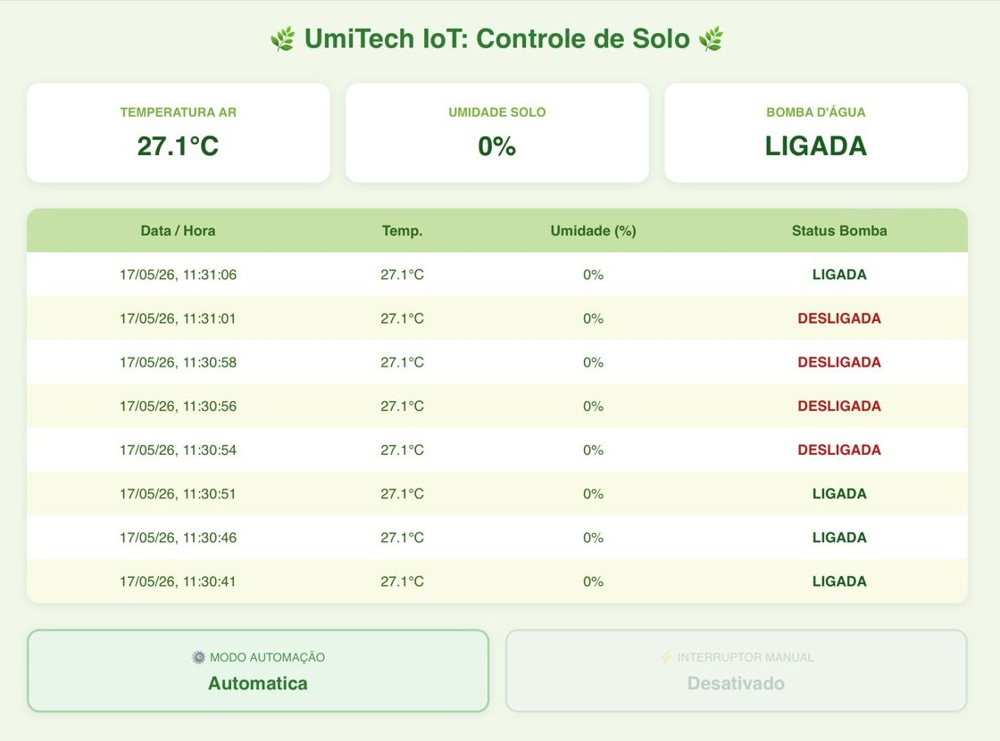
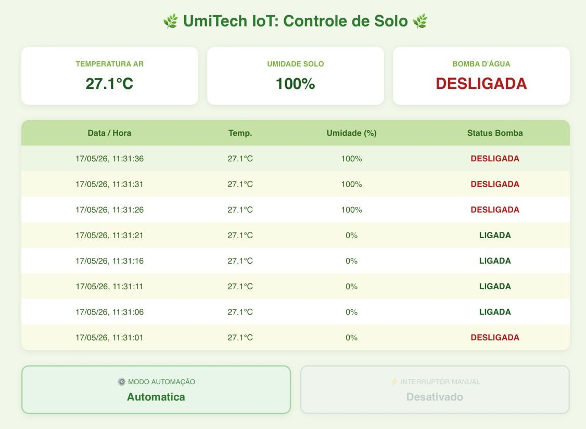
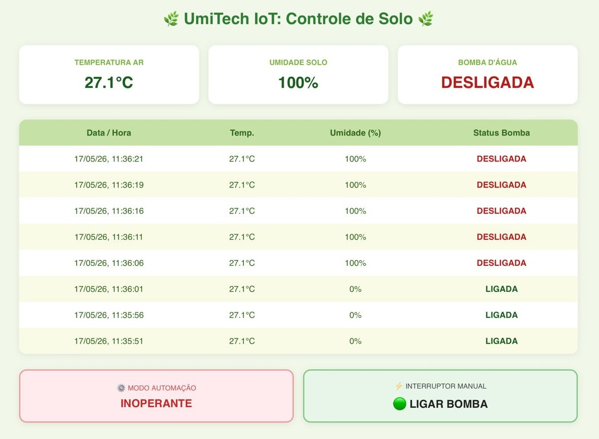
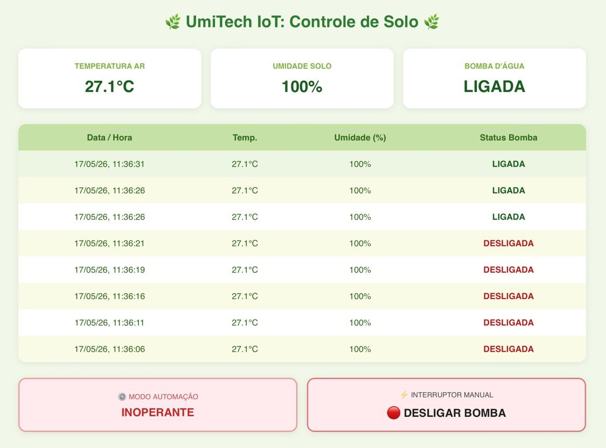
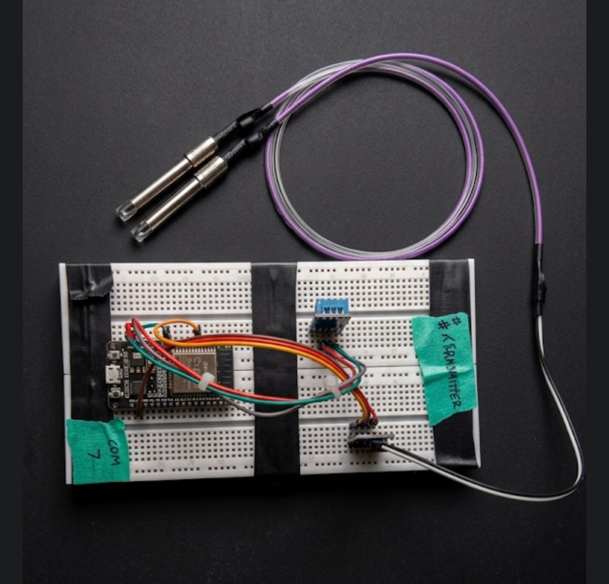
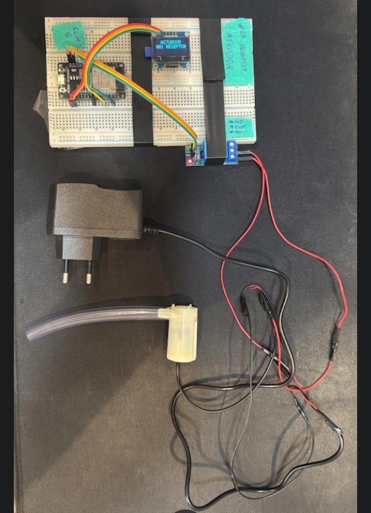

# 🌿 UmiTechIot - Sistema Automatizado de Irrigação e Controle de Temperatura do Solo.

Sistema inteligente de monitoramento e automação de irrigação utilizando **ESP32**, protocolo **ESP-NOW** e arquitetura **MVC**.

## 🚀 Sobre o Projeto
O UmiTech foi desenvolvido para resolver o problema de comunicação em áreas de plantio onde o Wi-Fi convencional não alcança. Utilizando a comunicação direta ponto-a-ponto, o sistema monitora a saúde do solo e do ar, decidindo o momento exato de acionar a irrigação de forma autônoma ou sob comando manual.

### 🛠 Tecnologias e Protocolos
- **ESP-NOW:** Comunicação de baixa latência, baixo consumo e longo alcance entre os módulos, operando sem a necessidade de um roteador.
- **Padrão MVC:** Organização de software que separa a lógica de dados (Model), a interface web/física (View) e o processamento de regras (Controller).
- **Web Server Assíncrono:** Dashboard web moderno em tempo real com histórico dinâmico contínuo e interruptor de segurança manual, hospedado nativamente no receptor.

---

## 📷 Demonstração do Sistema

Aqui estão algumas imagens do sistema em pleno funcionamento:

<p align="center">
  
  
  
  
</p>

<p align="center">
  
  
</p>

---

## 🏗 Arquitetura do Sistema

### 1. Nó Transmissor (Sensor)
- Leitura do sensor de umidade do solo (Higrômetro).
- Leitura de temperatura e umidade do ar (DHT11).
- Envio periódico dos pacotes de dados via ESP-NOW para o mestre.

### 2. Nó Receptor (Mestre/Atuador)
- **Controller:** Processa os pacotes ESP-NOW recebidos, gerencia o servidor assíncrono e valida os estados.
- **Model:** Mantém o estado atual e renderiza o histórico contínuo atualizado no navegador a cada 5 segundos.
- **View:** - **Digital:** Painel HTML5/CSS3 responsivo com modo automático e controle manual por botões dinâmicos coloridos.
    - **Física:** Display OLED de monitoramento local e acionamento físico do Módulo Relé para a Bomba d'água.

---

## 🔌 Esquema de Ligação (Pinagem)

### 🛰️ 1. Nó Transmissor

| Componente | Pino Componente | Pino ESP32 | Observação |
| :--- | :--- | :--- | :--- |
| **DHT11** | VCC | VIN (5V) | Alimentação do sensor |
| **DHT11** | DAT / OUT | D26 | Sinal de dados |
| **DHT11** | GND | GND | Terra comum |
| **Higrômetro** | VCC | VIN (5V) | Alimentação do sensor |
| **Higrômetro** | GND | GND | Terra comum |
| **Higrômetro** | A0 | D34 | Leitura Analógica (ADC) |

### 🎛️ 2. Nó Receptor

| Componente | Pino Componente | Pino ESP32 | Observação |
| :--- | :--- | :--- | :--- |
| **Display OLED** | GND | GND | Terra do Display |
| **Display OLED** | VDD / VCC | 3V3 | Alimentação lógica do display |
| **Display OLED** | SCK / SCL | D22 | Barramento I2C - Clock |
| **Display OLED** | SDA | D21 | Barramento I2C - Dados |
| **Módulo Relé** | IN | D5 | Sinal de controle da bomba |
| **Módulo Relé** | GND | GND | Terra do Relé |
| **Módulo Relé** | VCC | VIN (5V) | Alimentação da bobina do Relé |

### ⚡ 3. Circuito de Potência (Bomba d'água & Fonte 12V)
O Relé funciona como um interruptor para o polo Positivo (+) da alimentação da bomba:

* **Fonte 12V (Positivo)** ➡️ Pino **COM** (Comum) do Relé
* **Bomba d'água (Positivo)** ➡️ Pino **NO** (Normalmente Aberto) do Relé
* **Fonte 12V (Negativo)** ➡️ **Bomba d'água (Negativo)**

---

## 💻 Instalação e Configuração

1. Clone este repositório para sua máquina local:
   ```bash
   git clone [https://github.com/seu-usuario/UmiTechIot.git](https://github.com/seu-usuario/UmiTechIot.git)

---

Desenvolvido por Leonard Cirqueira - 2026
